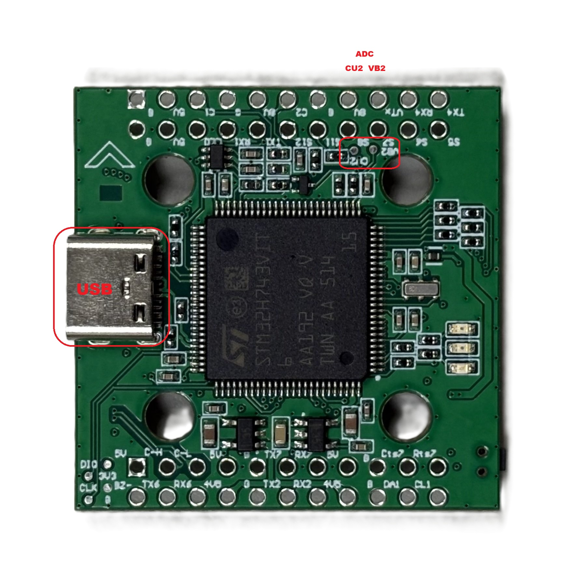
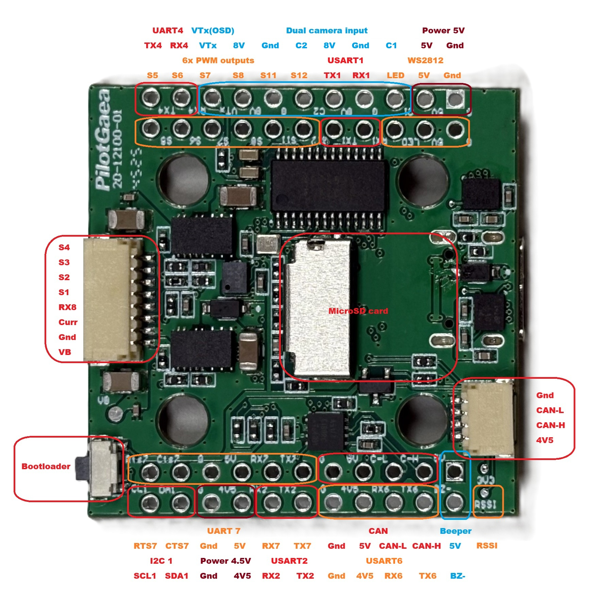

# PilotGaeaSH7V1 Flight Controller

The PilotGaeaSH7V1 is a flight controller designed and produced by PilotGaea

## Features

 - STM32H743 microcontroller
 - Dual ICM42688P IMUs
 - DPS310 barometer
 - AT7456E OSD
 - MicroSD card slot
 - Dual camera input
 - 1 USB
 - 5.5 UARTs, one with CTS/RTS flow control pins
 - 10 PWM / Dshot outputs
 - 1 I2C
 - 1 CAN
 - 5 ADC inputs
 - 5V/1.5A BEC for main power supply
 - 8V/1.5A BEC for powering Video Transmitter 

## Mechanical

 - Dimensions: 36 x 36 x 17 mm
 - Weight: 10.5g

## Physical and pinout

## Power supply

The PilotGaeaSH7V1 supports 3-8s Li battery input. It has 2 ways of BEC, which result in 3 ways of power supplys. Please see the table below.

| Power symbol | Power source                                      | Max power (current) |
|--------------|---------------------------------------------------|---------------------|
| BAT          | directly from battery                             |                     |
| 5V           | from 5V BEC                                       | 7.5W (1.5A)         |
| 8V           | from 8V BEC, controlled by MCU                    | 12W (1.5A)          |
| 4V5          | from USB or 5V BEC, diodes isolate the two powers | 4.7W (1A)           |

## UART Mapping

The UARTs are marked RXn and TXn in the above pinouts. The RXn pin is the receive pin for UARTn. The TXn pin is the transmit pin for UARTn.

 - SERIAL0 -> USB
 - SERIAL1 -> UART7 (support CTS and RTS)
 - SERIAL2 -> USART1
 - SERIAL3 -> USART2
 - SERIAL4 -> not available
 - SERIAL5 -> RX8 (RX8 is also available as ESC telem if protocol is changed for this UART)
 - SERIAL6 -> UART4
 - SERIAL7 -> USART6(RCIN)

Any UART can be re-tasked by changing its protocol parameter.

## RC Input

The default RC input is configured on the UART6 and supports all RC protocols except PPM. The SBUS pin is inverted and connected to RX6. RC can be attached to any UART port as long as the serial port protocol is set to `SERIALn_PROTOCOL=23` and SERIAL6_Protocol is changed to something other than '23'.

## OSD Support

The PilotGaeaSH7V1 Supports onboard analog OSD using the AT7456 chip.The composited image is output via the VTX pin.

## PWM Output and DShot

The PilotGaeaSH7V1 supports up to 11 PWM outputs.organized into 5 independent timer groups. All groups support DShot, but **Bi-directional DShot (BDShot)** is optimized for Groups 1-3.

### PWM Grouping Table

| Group | PWM Output | Timer | BDShot Support (hwdef-bl) | Recommended Use |
| :--- | :--- | :--- | :--- | :--- |
| **1** | 1, 2 | TIM8 | **Full (DMA)** | Motors 1-2 |
| **2** | 3, 4, 5, 6 | TIM5 | **Full (DMA)** | Motors 3-6 |
| **3** | 7, 8 | TIM4 | **Full (DMA)** | Motors 7-8 |
| **4** | 11, 12 | TIM15 | No (NODMA) | Servos / Auxiliary |
| **5** | 13 (LED) | TIM1 | No (NODMA) | NeoPixel / WS2812 |

### Bi-directional DShot Configuration
To use BDShot for RPM filtering, you must flash the `PilotGaeaSH7V1-bdshot` firmware. 
- **Outputs 1-8:** Fully optimized with dedicated DMA resources to ensure stable DShot600 performance and telemetry feedback.
- **Outputs 11-13:** Configured with `NODMA`. While they support standard PWM/DShot, they do not support RPM telemetry. This design prioritizes DMA bandwidth for the primary IMU (SPI1) and core motor functions.

> **Note:** Every output within a group must use the same output protocol (e.g., if Output 3 is set to DShot, Outputs 4, 5, and 6 must also be DShot).

## Battery Monitoring

The board has two internal voltage sensors and two external current sensor input.
The voltage sensors can handle up to 8S LiPo batteries.
Enable Battery monitor with these parameter settings :
* BATT_MONITOR 4
Then reboot.
* BATT_VOLT_PIN 10
* BATT_CURR_PIN 11
* BATT_VOLT_MULT 11
* BATT_AMP_PERVLT 40
* BATT2_VOLT_PIN 18
* BATT2_CURR_PIN 7
* BATT2_VOLT_MULT 21
* BATT2_AMP_PERVLT 40

## Compass

The PilotGaeaSH7V1 has no built-in compass, so if needed, you should use an external compass.

## Analog cameras

The PilotGaeaSH7V1 supports up to 2 cameras, connected to pin C1 and C2. You can select the video signal to VTX from camera by an RC channel. Set the parameters below:
- RELAY2_FUNCTION 1
- RELAY_PIN2 82
- RC8_OPTION 34

## 8V switch

The 8V power supply can be controlled by an RC channel. Set the parameters below:
- RELAY1_FUNCTION  1
- RELAY_PIN 81
- RC7_OPTION 28

## Loading Firmware

Initial firmware load can be done with DFU by plugging in USB with the bootloader button pressed.Then you should load the "*with_bl.hex" firmware, using your favourite DFU loading tool.
Once the initial firmware is loaded you can update the firmware using any ArduPilot ground station software. Updates should be done with the "\*.apj" firmware files.
